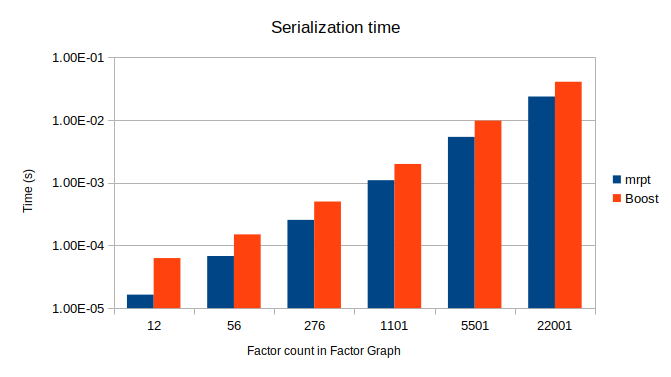
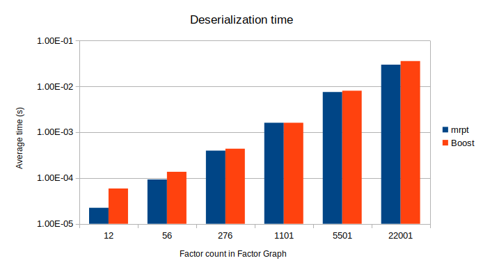

[](https://github.com/MRPT/gtsam2mrpt_serial/actions/workflows/cmake.yml)

| Distro | Build dev | Build releases | Stable version |
| --- | --- | --- | --- |
| ROS 2 Humble (Ubuntu 22.04) | [](https://build.ros2.org/job/Hdev__gtsam2mrpt_serial__ubuntu_jammy_amd64/) | amd64 [](https://build.ros2.org/job/Hbin_uJ64__gtsam2mrpt_serial__ubuntu_jammy_amd64__binary/) · arm64 [](https://build.ros2.org/job/Hbin_ujv8_uJv8__gtsam2mrpt_serial__ubuntu_jammy_arm64__binary/) | [](https://index.ros.org/?search_packages=true&pkgs=gtsam2mrpt_serial) |
| ROS 2 Jazzy (Ubuntu 24.04) | [](https://build.ros2.org/job/Jdev__gtsam2mrpt_serial__ubuntu_noble_amd64/) | amd64 [](https://build.ros2.org/job/Jbin_uN64__gtsam2mrpt_serial__ubuntu_noble_amd64__binary/) · arm64 [](https://build.ros2.org/job/Jbin_unv8_uNv8__gtsam2mrpt_serial__ubuntu_noble_arm64__binary/) | [](https://index.ros.org/?search_packages=true&pkgs=gtsam2mrpt_serial) |
| ROS 2 Kilted (Ubuntu 24.04) | [](https://build.ros2.org/job/Kdev__gtsam2mrpt_serial__ubuntu_noble_amd64/) | amd64 [](https://build.ros2.org/job/Kbin_uN64__gtsam2mrpt_serial__ubuntu_noble_amd64__binary/) · arm64 [](https://build.ros2.org/job/Kbin_unv8_uNv8__gtsam2mrpt_serial__ubuntu_noble_arm64__binary/) | [](https://index.ros.org/?search_packages=true&pkgs=gtsam2mrpt_serial) |
| ROS 2 Rolling (Ubuntu 24.04) | [](https://build.ros2.org/job/Rdev__gtsam2mrpt_serial__ubuntu_noble_amd64/) | amd64 [](https://build.ros2.org/job/Rbin_uN64__gtsam2mrpt_serial__ubuntu_noble_amd64__binary/) · arm64 [](https://build.ros2.org/job/Rbin_unv8_uNv8__gtsam2mrpt_serial__ubuntu_noble_arm64__binary/) | [](https://index.ros.org/?search_packages=true&pkgs=gtsam2mrpt_serial) |

# gtsam2mrpt_serial

A C++ library providing a bidirectional serialization bridge between [GTSAM](https://gtsam.org/) and [mrpt-serialization](https://docs.mrpt.org/reference/latest/group_mrpt_serialization_grp.html).

Serialize and deserialize GTSAM data structures — including `NonlinearFactorGraph` and `Values` — to and from any mrpt I/O stream (files, sockets, pipes) with optional transparent compression.

## Features

- **Fast** — benchmarks show roughly half the wall-clock time of GTSAM's native Boost binary serialization for mid-sized graphs (see [Performance](#performance)).
- **Portable** — the binary format is stable across machine architectures, endianness, word sizes, and operating systems, unlike Boost serialization.
- **Versioned** — a version tag is embedded in every serialized object so that future library releases can read files produced by older ones.
- **Compressed** — transparent `.gz` and `.zstd` compression is available via [`mrpt::io::CCompressedOutputStream`](https://docs.mrpt.org/reference/latest/class_mrpt_io_CCompressedOutputStream.html) at no extra cost to the caller.
- **Stream-agnostic** — works with any stream in [mrpt-io](https://docs.mrpt.org/reference/latest/group_mrpt_io_grp.html): local files, TCP sockets, named pipes, in-memory buffers, and more.

## Requirements

- **C++17** or newer (required by MRPT).
- **MRPT** ≥ 2.4: install via `sudo apt install libmrpt-dev` (Ubuntu 22.04+), via the ROS 2 packages listed in the table above, or follow the [MRPT install guide](https://docs.mrpt.org/reference/latest/download-mrpt.html).
- **GTSAM**: build from source or install from [the official PPA](https://gtsam.org/get_started/).

## Supported types

| Category | Types |
| --- | --- |
| Values | `Pose2`, `Pose3`, `Point2`, `Point3`, `Rot2`, `Rot3` |
| Factors | `PriorFactor<T>`, `BetweenFactor<T>` for all value types above |
| Noise models | `Gaussian`, `Diagonal`, `Isotropic`, `Constrained`, `Unit`, `Robust` (with all built-in m-estimators) |

## Usage

Include the single header and use the `<<` / `>>` stream operators:

```cpp
#include <gtsam2mrpt_serial/serialize.h>
#include <mrpt/io/CCompressedOutputStream.h>
#include <mrpt/serialization/CArchive.h>

using namespace gtsam2mrpt_serial;

// --- Serialize ---
gtsam::NonlinearFactorGraph graph = /* ... */;
gtsam::Values               initial = /* ... */;

mrpt::io::CCompressedOutputStream f("graph.mrpt.zstd");
auto arch = mrpt::serialization::archiveFrom(f);
arch << graph << initial;

// --- Deserialize ---
mrpt::io::CCompressedInputStream f2("graph.mrpt.zstd");
auto arch2 = mrpt::serialization::archiveFrom(f2);

gtsam::NonlinearFactorGraph graph2;
gtsam::Values               initial2;
arch2 >> graph2 >> initial2;
```

For a more complete example, see [`gtsam2mrpt_serial/tests/main.cpp`](gtsam2mrpt_serial/tests/main.cpp).

## Installation

### From ROS 2 packages (recommended)

```bash
sudo apt install ros-$ROS_DISTRO-gtsam2mrpt-serial
```

### From source

```bash
mkdir -p ~/ros2_ws/src && cd ~/ros2_ws/src
git clone https://github.com/MRPT/gtsam2mrpt_serial.git
cd ~/ros2_ws
colcon build --packages-select gtsam2mrpt_serial
```

## Performance

Profiling against GTSAM's native Boost binary serialization on an Intel Core i7-6700HQ @ 2.60 GHz (Ubuntu 20.04, Boost 1.71, MRPT 2.4.4) shows approximately **2× faster serialization and deserialization** for mid-sized factor graphs. The time axis below is logarithmic.

**Serialization**


**Deserialization**


Benchmarking code: [`gtsam2mrpt_serial/tests/main.cpp`](gtsam2mrpt_serial/tests/main.cpp).

## License

Released under the [3-clause BSD license](LICENSE).