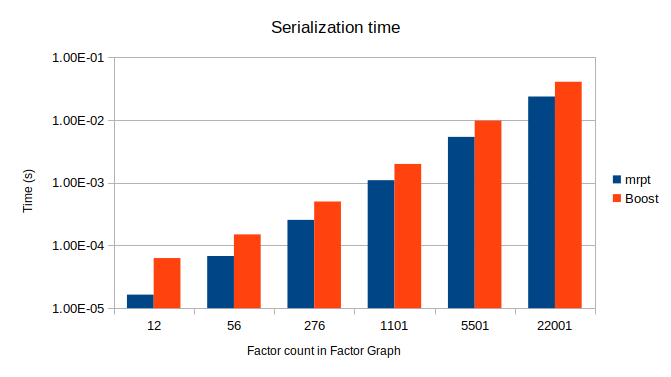
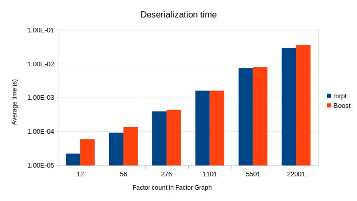

# gtsam2mrpt_serial
A C++ library offering a GTSAM ⇆ mrpt-serialization bridge.

This library offers efficient, binary serialization of GTSAM data structures, including whole `NonLinearFactorGraphs` and `Values`.
Storage format has the advantages of [mrpt-serialization](https://docs.mrpt.org/reference/latest/group_mrpt_serialization_grp.html):
- Fast and efficient (binary storage by default).
- Binary files are **portable** between machine architectures, endianness, word size, and operative system (unlike Boost).
- Support for **versioning**, so future versions will be able to read old files.
- Automatic support for `.gz` compression via [mrpt::io::CFileGZOutputStream](https://docs.mrpt.org/reference/latest/class_mrpt_io_CFileGZOutputStream.html).
- GTSAM objects can be serialized to/from any stream defined in [mrpt-io](https://docs.mrpt.org/reference/latest/group_mrpt_io_grp.html), like TCP sockets, files, or pipes.

C++17 is required since that is the minimum C++ standard required by MRPT. 

## Dependencies

- MRPT: Install with `sudo apt install libmrpt-dev` (on Ubuntu 22.04 or newer) or otherwise [see install instructions](https://docs.mrpt.org/reference/latest/download-mrpt.html).
- GTSAM: Build from sources or install from [the PPA](https://gtsam.org/get_started/).

## Examples of use. 

See [gtsam2mrpt_serial/tests/main.cpp](gtsam2mrpt_serial/tests/main.cpp).

## Performance

Simple performance profiling shows an average time cost of roughly **50% the native Boost binary serialization mechanism** for mid-sized graphs.

The following quantitative analysis was done with [this code](gtsam2mrpt_serial/tests/main.cpp), on an Ubuntu 20.04 (Boost 1.71, MRPT 2.4.4) and a Intel(R) Core(TM) i7-6700HQ CPU @ 2.60GHz CPU. Note that the time scale is **logarithmic**.

